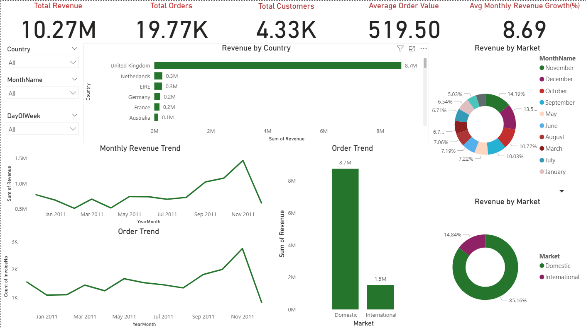
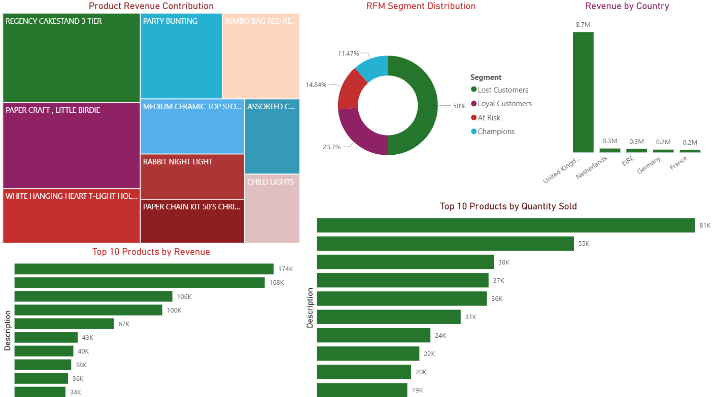

# Online Retail Sales Analytics Dashboard


<p align="center">


</p>

---

# Dashboard Preview

<p align="center">



</p>

---

# Table of Contents

- [Project Overview](#project-overview)
- [Business Problem](#business-problem)
- [Project Objectives](#project-objectives)
- [Dataset](#dataset)
- [Tools & Technologies](#tools--technologies)
- [Project Workflow](#project-workflow)
- [Repository Structure](#repository-structure)
- [Data Cleaning](#data-cleaning)
- [Feature Engineering](#feature-engineering)
- [Exploratory Data Analysis](#exploratory-data-analysis)
- [Advanced Customer Analytics](#advanced-customer-analytics)
- [Interactive Power BI Dashboard](#interactive-power-bi-dashboard)
- [Executive Summary](#executive-summary)
- [Key Findings](#key-findings)
- [Business Opportunities](#business-opportunities)
- [Recommendations](#recommendations)
- [Final Conclusion](#final-conclusion)
- [Installation](#installation)
- [Future Improvements](#future-improvements)
- [Author](#author)
- [License](#license)

---

# Project Overview

This project presents an end-to-end retail sales analytics solution developed using **Python** and **Power BI**. The objective was to analyze one year of online retail transactions to uncover actionable insights into sales performance, customer purchasing behavior, product performance, geographic trends, customer segmentation, and customer retention.

Rather than focusing solely on descriptive statistics, the project follows the complete analytics lifecycle—from raw transactional data through data preparation, feature engineering, exploratory data analysis (EDA), advanced customer analytics, business KPI reporting, and interactive dashboard development.

The project demonstrates practical skills expected of a Data Analyst, including:

- Data quality assessment
- Data cleaning and preprocessing
- Feature engineering
- Exploratory data analysis
- Business KPI reporting
- Customer analytics
- Dashboard design
- Business storytelling

<p align="right">
<a href="#-online-retail-sales-analytics-dashboard">⬆ Back to Top</a>
</p>

---

# Business Problem

An online retail company requires insights into its transactional data to support strategic business decision-making.

Management seeks to answer several important business questions:

- Which products generate the highest revenue?
- Which customers contribute the greatest business value?
- How effectively are customers retained?
- Which markets perform best?
- What seasonal trends influence revenue?
- How concentrated is revenue among customers?
- Which customer groups deserve greater business focus?

Answering these questions enables management to improve customer retention, optimize product offerings, increase profitability, and support sustainable business growth.

<p align="right">
<a href="#-online-retail-sales-analytics-dashboard">⬆ Back to Top</a>
</p>

---

# Project Objectives

The primary objectives of this project were to:

- Analyze overall sales performance.
- Identify top-performing and underperforming products.
- Evaluate customer purchasing behaviour.
- Measure customer retention through Cohort Analysis.
- Segment customers using RFM Analysis.
- Apply Pareto Analysis (80/20 Rule) to identify high-value customers.
- Compare domestic and international market performance.
- Develop an interactive Power BI dashboard for executive reporting.
- Translate analytical findings into actionable business recommendations.

<p align="right">
<a href="#-online-retail-sales-analytics-dashboard">⬆ Back to Top</a>
</p>

---

# Dataset

**Source**

[UCI Machine Learning Repository](https://archive.ics.uci.edu/dataset/352/online+retail)

**Dataset**

Online Retail Dataset

**Period Covered**

December 2010 – December 2011

### Dataset Summary

| Metric | Value |
|---------|------:|
| Original Transactions | 541,909 |
| Cleaned Transactions | 527,792 |
| Completed Orders | 19,773 |
| Unique Customers | 4,335 |
| Total Revenue | £10.27 Million |

> **Note:** The original dataset is not included in this repository because of GitHub file size limitations. Please download it from the UCI Machine Learning Repository and place it inside the **data/** folder before running the notebook.

<p align="right">
<a href="#-online-retail-sales-analytics-dashboard">⬆ Back to Top</a>
</p>

---

# Tools & Technologies

| Category | Technology |
|-----------|------------|
| Programming Language | Python |
| Data Manipulation | Pandas |
| Numerical Computing | NumPy |
| Visualization | Matplotlib |
| Statistical Visualization | Seaborn |
| Dashboard Development | Power BI |
| Notebook Environment | Jupyter Notebook |
| Version Control | Git & GitHub |

<p align="right">
<a href="#-online-retail-sales-analytics-dashboard">⬆ Back to Top</a>
</p>

---

# Project Workflow

```text
Raw Dataset
      │
      ▼
Data Quality Assessment
      │
      ▼
Data Cleaning
      │
      ▼
Feature Engineering
      │
      ▼
Exploratory Data Analysis
      │
      ▼
Customer Analytics
      │
      ├── Pareto Analysis
      ├── RFM Segmentation
      └── Cohort Analysis
      │
      ▼
Business KPIs
      │
      ▼
Power BI Dashboard
      │
      ▼
Business Insights & Recommendations
```

<p align="right">
<a href="#-online-retail-sales-analytics-dashboard">⬆ Back to Top</a>
</p>

---

# Data Cleaning

The dataset underwent a comprehensive quality assessment before analysis to ensure reliable business insights.

The following cleaning activities were performed:

- Removed cancelled invoices.
- Removed bad debt adjustment transactions.
- Removed transactions with negative quantities.
- Removed invalid pricing records.
- Removed records with missing product descriptions.
- Removed administrative and non-product transactions.
- Removed duplicate records.
- Converted date fields into datetime format.
- Validated invoice-level revenue calculations.
- Verified customer and product identifiers.

The resulting analytical dataset consisted of **527,792 high-quality retail transactions**, suitable for business reporting and customer analytics.

<p align="right">
<a href="#-online-retail-sales-analytics-dashboard">⬆ Back to Top</a>
</p>

---

# Feature Engineering

Several analytical features were created to enrich the dataset and support advanced business analysis.

Engineered variables include:

- Revenue
- Year
- Month
- Month Name
- Year-Month
- Day of Week
- Hour
- Purchase Month
- Cohort Month
- Cohort Index
- Market (Domestic vs International)
- Basket Size
- Average Order Value (AOV)
- Customer Lifetime Revenue
- RFM Metrics
  - Recency
  - Frequency
  - Monetary

These engineered features formed the foundation for exploratory analysis, customer segmentation, business KPI calculation, and dashboard reporting.

<p align="right">
<a href="#-online-retail-sales-analytics-dashboard">⬆ Back to Top</a>
</p>

---

# Exploratory Data Analysis

The exploratory analysis focused on answering key business questions across sales performance, customer behaviour, and product performance.

Analyses included:

- Revenue Analysis
- Monthly Revenue Trends
- Monthly Order Trends
- Daily Sales Patterns
- Revenue by Country
- Revenue by Market
- Product Performance
- Top Products
- Bottom Products
- Product Revenue Contribution
- Customer Spending Distribution
- Purchase Frequency Distribution
- Basket Analysis
- Average Basket Size
- Average Order Value
- Seasonal Purchasing Patterns
- Correlation Analysis

Each analysis was accompanied by business interpretation to translate statistical findings into practical recommendations.

<p align="right">
<a href="#-online-retail-sales-analytics-dashboard">⬆ Back to Top</a>
</p>

---

# Advanced Customer Analytics

The project extends beyond traditional EDA by incorporating advanced customer analytics techniques commonly used in business intelligence and CRM.

## Pareto Analysis (80/20 Rule)

Identified the proportion of customers responsible for the majority of total business revenue, highlighting the concentration of revenue among high-value customers.

---

## RFM Segmentation

Customers were segmented using three behavioural metrics:

- Recency
- Frequency
- Monetary Value

Customer segments include:

- Champions
- Loyal Customers
- At Risk
- Lost Customers

---

## Cohort Analysis

Monthly cohort analysis was performed to evaluate customer retention over time, enabling the business to understand repeat purchasing behaviour and long-term customer engagement.

<p align="right">
<a href="#-online-retail-sales-analytics-dashboard">⬆ Back to Top</a>
</p>

---

# Interactive Power BI Dashboard

The Power BI dashboard is organised into three report pages.

---

## 📈 Page 1 – Executive Overview

**Features**

- Total Revenue
- Total Orders
- Total Customers
- Average Order Value
- Average Monthly Revenue Growth
- Monthly Revenue Trend
- Monthly Order Trend
- Revenue by Country
- Revenue by Market
- Interactive slicers

> Dashboard Preview
<p align="center">


---

## 📦 Page 2 – Product & Market Performance

**Features**

- Top 10 Products by Revenue
- Top 10 Products by Quantity Sold
- Product Revenue Contribution
- Revenue by Country

> 📷 Replace with your screenshot.

```markdown

```

---

## 👥 Page 3 – Customer Analytics

**Features**

- RFM Segment Distribution
- Revenue by Customer Segment
- Customer Retention Cohort Heatmap

> 📷 Replace with your screenshot.

```markdown

```

<p align="right">
<a href="#-online-retail-sales-analytics-dashboard">⬆ Back to Top</a>
</p>

---

# ➜ Continue to Part 2

Part 2 contains:

- Executive Summary
- Key Findings
- Business Opportunities
- Recommendations
- Final Conclusion
- Installation Guide
- Repository Structure
- Future Improvements
- Author
- License
- Acknowledgements


# Executive Summary

This project analyzed one year of transaction data from an online retail business to understand sales performance, customer behavior, product performance, geographic trends, and customer retention.

The dataset underwent a comprehensive data quality assessment, cleaning process, feature engineering, exploratory data analysis (EDA), advanced customer analytics, business KPI reporting, and interactive dashboard development.

After removing cancelled transactions, bad debt adjustments, records with invalid quantities, missing product descriptions, duplicate records, administrative transactions, and invalid pricing records, a clean analytical dataset containing **527,792 transactions** was prepared for analysis.

The business generated approximately **£10.27 million** in revenue from **19,773 completed orders** placed by **4,335 unique customers** during the analysis period.

The analysis further revealed valuable insights into customer purchasing behavior, revenue concentration, product performance, seasonal demand, and customer retention, enabling data-driven business recommendations.

<p align="right">
<a href="#-online-retail-sales-analytics-dashboard">⬆ Back to Top</a>
</p>

---

# Key Findings

## 1. Revenue Growth Was Strong but Highly Seasonal

The business demonstrated positive performance throughout the year, achieving an average monthly revenue growth rate of approximately **8.69%** after excluding the incomplete final month.

Revenue accelerated significantly during the final quarter, with:

- September revenue exceeding **£1 million**
- October revenue exceeding **£1.1 million**
- November generating the highest monthly revenue at approximately **£1.46 million**

This trend indicates strong seasonal demand leading into the holiday shopping period.

---

## 2. Domestic Sales Drive Revenue While International Customers Spend More

Although domestic customers generated the majority of revenue and order volume, international customers consistently recorded substantially larger transaction values.

| Market | Revenue | Orders | Average Order Value |
|---------|---------:|-------:|--------------------:|
| Domestic | £8.75M | 17,901 | £488.70 |
| International | £1.52M | 1,872 | £814.03 |

International customers placed fewer orders but generated significantly higher basket values, suggesting opportunities for international expansion.

---

## 3. Revenue Is Concentrated Among High-Value Customers

Pareto Analysis confirmed that business revenue is not evenly distributed across the customer base.

A relatively small proportion of customers contributed the majority of overall revenue, demonstrating the classic **80/20 Principle** where a minority of customers generate most business value.

This finding highlights the importance of customer retention and relationship management.

---

## 4. Champions and Loyal Customers Drive Business Success

RFM Segmentation identified four major customer groups.

| Segment | Customers |
|---------|----------:|
| Champions | 497 |
| Loyal Customers | 1,027 |
| At Risk | 643 |
| Lost Customers | 2,167 |

Champions generated the highest average customer revenue and represent the company's most valuable customer base.

Lost Customers account for nearly half of all customers, indicating significant customer attrition over time.

---

## 5. Customer Retention Presents a Major Growth Opportunity

Monthly Cohort Analysis revealed that customer retention declines rapidly after the initial purchase.

First-month retention generally ranged between **15% and 25%**, indicating that many customers make only one purchase.

However, customers who remain active frequently continue purchasing across multiple months, demonstrating the long-term value of retained customers.

---

## 6. Customer Purchasing Behaviour Is Highly Skewed

Purchase frequency analysis revealed:

- Approximately **34.7%** of customers purchased only once.
- A much smaller group placed repeated orders.
- Purchase frequency follows a heavily right-skewed distribution.

These findings reinforce the importance of retention strategies aimed at encouraging repeat purchases.

---

## 7. Larger Baskets Generate Higher Revenue

Basket analysis showed:

- Average Basket Size: **282 units**
- Average Order Value: **£519.50**
- Correlation between Basket Size and Revenue: **0.89**

Customers purchasing larger quantities generally generated higher transaction values.

This finding supports opportunities for cross-selling, upselling, and product bundling.

<p align="right">
<a href="#-online-retail-sales-analytics-dashboard">⬆ Back to Top</a>
</p>

---

# Business Opportunities

The analysis identified several opportunities to improve overall business performance.

## Improve Customer Retention

Customer retention represents the largest opportunity for sustainable revenue growth.

Even modest improvements in repeat purchase rates could substantially increase Customer Lifetime Value while reducing customer acquisition costs.

---

## Expand International Sales

International customers spend significantly more per order than domestic customers.

Increasing international market penetration through targeted marketing campaigns and localized sales strategies could improve overall profitability.

---

## Protect High-Value Customers

Champions and Loyal Customers contribute a disproportionate share of total revenue.

Retaining these customers should remain a strategic priority through loyalty initiatives and personalized engagement.

---

## Increase Basket Size

The strong relationship between basket size and revenue suggests opportunities to increase sales through:

- Cross-selling
- Product recommendations
- Product bundles
- Volume discounts

---

## Leverage Seasonal Demand

Revenue consistently peaks during the final quarter of the year.

Planning inventory, staffing, and promotional campaigns around this period could maximize seasonal sales opportunities.

<p align="right">
<a href="#-online-retail-sales-analytics-dashboard">⬆ Back to Top</a>
</p>

---

# Business Recommendations

Based on the analytical findings, the following recommendations are proposed.

## Recommendation 1 — Implement Customer Loyalty Programs

Introduce structured loyalty programs designed to reward repeat purchasing and encourage long-term customer engagement.

Examples include:

- Points-based reward systems
- Tiered memberships
- Exclusive discounts
- Early access promotions

---

## Recommendation 2 — Launch Customer Reactivation Campaigns

Develop personalized campaigns targeting **At Risk** and **Lost Customers**.

Possible approaches include:

- Email marketing
- Discount offers
- Product recommendations
- Personalized promotions

---

## Recommendation 3 — Prioritize High-Value Customer Retention

Develop dedicated retention strategies for Champions and Loyal Customers.

Examples include:

- VIP membership programs
- Personalized communications
- Exclusive product launches
- Premium customer support

---

## Recommendation 4 — Accelerate International Expansion

Allocate additional marketing resources toward international markets where Average Order Value is substantially higher.

Localized promotions and international shipping incentives may further increase revenue.

---

## Recommendation 5 — Optimize Product Bundling

Use complementary product recommendations and bundle offers to increase Average Order Value and Basket Size.

---

## Recommendation 6 — Prepare for Seasonal Demand

Increase inventory planning and promotional activity before peak shopping periods, particularly during September through November.

<p align="right">
<a href="#-online-retail-sales-analytics-dashboard">⬆ Back to Top</a>
</p>

---

# Final Conclusion

This project demonstrates a complete end-to-end business analytics workflow using Python and Power BI.

Starting from raw transactional data, the project progressed through data quality assessment, preprocessing, feature engineering, exploratory data analysis, advanced customer analytics, KPI reporting, and dashboard development.

The business exhibits strong revenue performance, valuable high-spending customer segments, and pronounced seasonal purchasing behavior. At the same time, the analysis identifies significant opportunities to improve customer retention, increase basket size, expand international sales, and strengthen customer lifetime value.

The resulting dashboard provides business stakeholders with an interactive reporting solution capable of supporting strategic decision-making through data-driven insights.

<p align="right">
<a href="#-online-retail-sales-analytics-dashboard">⬆ Back to Top</a>
</p>

---

# Repository Structure

```text
online-retail-sales-analytics/
│
├── data/
│   └── OnlineRetail.csv
│
├── notebooks/
│   └── Online_Retail_Analytics.ipynb
│
├── dashboard/
│   └── OnlineRetailDashboard.pbix
│
├── images/
│   ├── executive_dashboard.png
│   ├── product_market_performance.png
│   ├── customer_analytics.png
│   ├── cohort_heatmap.png
│
├── requirements.txt
├── README.md
└── LICENSE
```

<p align="right">
<a href="#-online-retail-sales-analytics-dashboard">⬆ Back to Top</a>
</p>

---

# Installation

Clone the repository:

```bash
git clone https://github.com/yourusername/online-retail-sales-analytics.git
```

Navigate into the project directory:

```bash
cd online-retail-sales-analytics
```

Install the required Python libraries:

```bash
pip install -r requirements.txt
```

Launch Jupyter Notebook:

```bash
jupyter notebook
```

Open:

```
Online_Retail_Analytics.ipynb
```

Run all notebook cells sequentially.

Finally, open the Power BI dashboard:

```
dashboard/OnlineRetailDashboard.pbix
```

> **Note:** Download the Online Retail Dataset separately and place it in the `data/` directory before running the notebook.

<p align="right">
<a href="#-online-retail-sales-analytics-dashboard">⬆ Back to Top</a>
</p>

---

# Requirements

```text
pandas
numpy
matplotlib
seaborn
jupyter
openpyxl
```

---

# Future Improvements

Potential enhancements include:

- Deploy the dashboard using Power BI Service.
- Automate data refresh through scheduled ETL pipelines.
- Integrate SQL as a production data source.
- Develop predictive sales forecasting models.
- Build Customer Lifetime Value prediction models.
- Add demand forecasting using machine learning.
- Develop a real-time dashboard using streaming data.
- Containerize the project using Docker.
- Deploy the analytics pipeline to a cloud platform.

<p align="right">
<a href="#-online-retail-sales-analytics-dashboard">⬆ Back to Top</a>
</p>

---

# Acknowledgements

This project uses the **Online Retail Dataset** from the **UCI Machine Learning Repository**, a widely used dataset for business intelligence, customer analytics, and retail sales analysis.

Special thanks to the open-source Python community and Microsoft Power BI for providing powerful tools that support end-to-end analytics workflows.

<p align="right">
<a href="#-online-retail-sales-analytics-dashboard">⬆ Back to Top</a>
</p>

---

# Author

**Tawakalt**

This project was developed as part of my Data Analytics portfolio to demonstrate practical skills in:

- Python
- Data Cleaning
- Feature Engineering
- Exploratory Data Analysis
- Business Intelligence
- Customer Analytics
- Power BI Dashboard Development
- Business Storytelling

Feel free to connect or provide feedback on the project.

<p align="right">
<a href="#-online-retail-sales-analytics-dashboard">⬆ Back to Top</a>
</p>

---

# License

This project is licensed under the MIT License.

See the **LICENSE** file for more information.

<p align="center">

⭐ If you found this project helpful, consider starring the repository!

</p>


